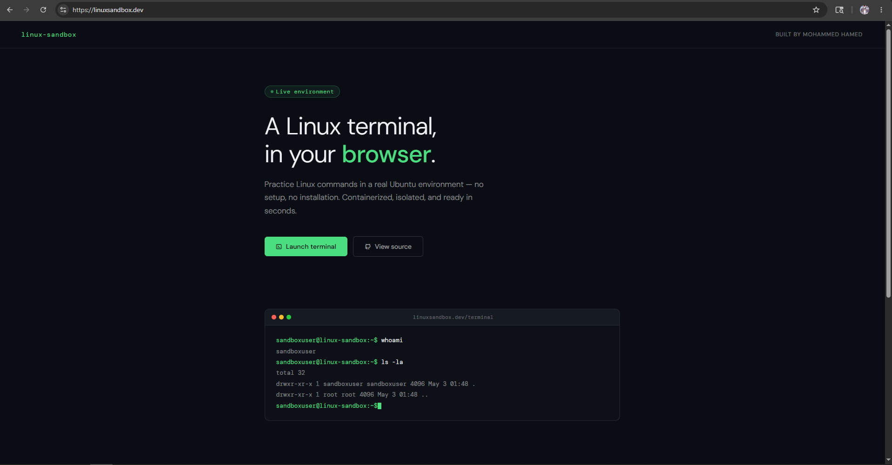
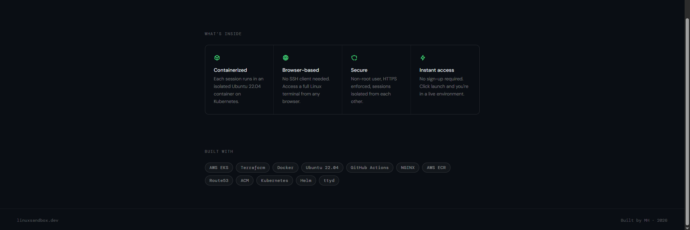
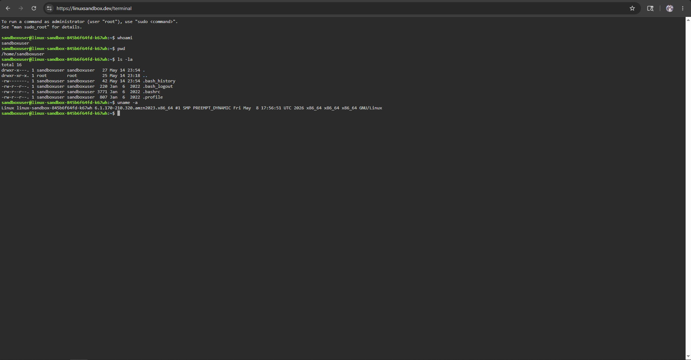
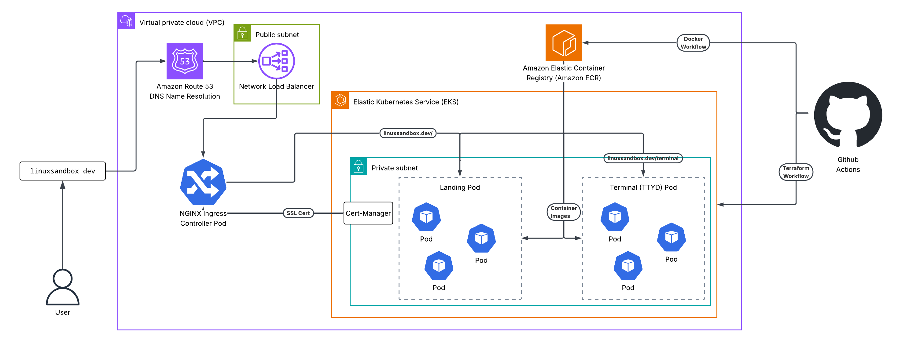

# Linux Sandbox

Linux Sandbox is a cloud-native application hosting an Ubuntu environment right in the browser. Any user can visit linuxsandbox.dev and start practicing Linux commands. 

Built on AWS EKS, provisioned with Terraform, and deployed via a GitHub Actions CI/CD pipeline. The cluster is currently spun down to manage costs — screenshots below.

## About

The sandbox utilizes a custom Ubuntu Docker image which lives in the AWS Elastic Container Registry. An AWS Virtual Private Cloud runs EKS which is configured to pull the image from ECR. An NGINX Ingress controller is used to route traffic (HTTP/HTTPS) to the cluster. Cert-manager then handles the SSL certificate for the domain, and Route53 points the domain to the load balancer. Finally GitHub Actions has docker and terraform CI/CD pipelines to automate image build/push, credential authentication, and terraform apply.

## Screenshots

## Architecture 

